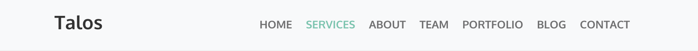
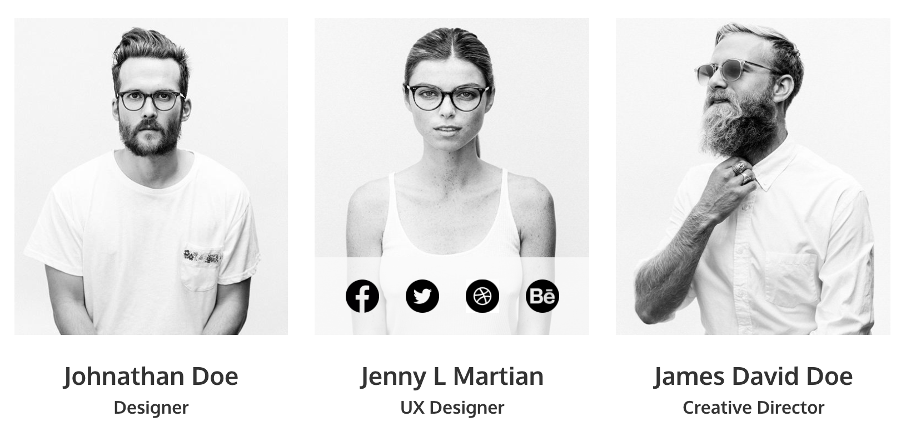
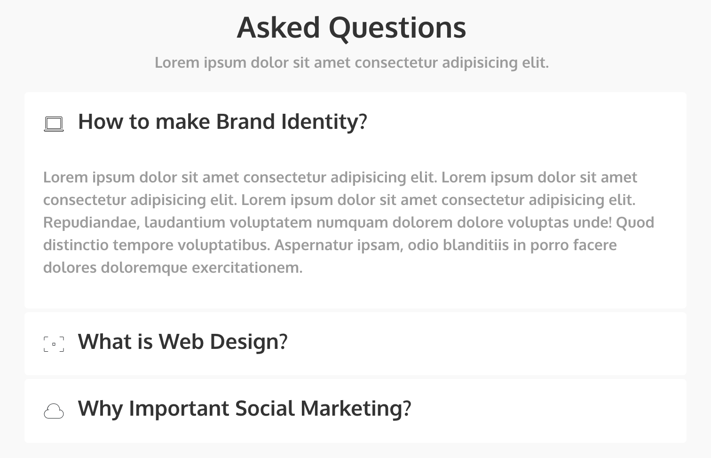

# First project
This project is a Static web page strucutured with HTML, CSS, JavaScript, using the [Bootstrap](https://getbootstrap.com/docs/5.0/getting-started/introduction/) library.

The Web page contains mainly the sections of services, portfolio, work-team, contact, and other important information about the company, Talos.

___
## Navbar
You can navigate through the page scrolling or using the navbar menu shown below:

## Team
To see and access our team member's social media, you can hover over each photo.

## FAQ
You can read the answers to the frequently asked questions by clicking on the one you are interested in.

___
## Deployed Project
### FIREBASE
[Firebase Hosting](https://firebase.google.com/?hl=es-419&gclid=CKWpjufJye4CFYn0Hwod4MEJHg) is a web content hosting for developers, it was used to push the project to a server.  

If you want to see the deployed project [CLICK HERE.](https://first-project-a7b35.web.app)

You can also see the web site content like this:
- Right click on the HTML file.
- Click on Copy Path.
- Paste this path in a browser tab and enter.

---
## Need some help?
If you have any questions or recommendations you can contact me at: valentina.gomez@talosdigital.com

---

This project was made by Valentina Gomez Giraldo for Talos Inc.
